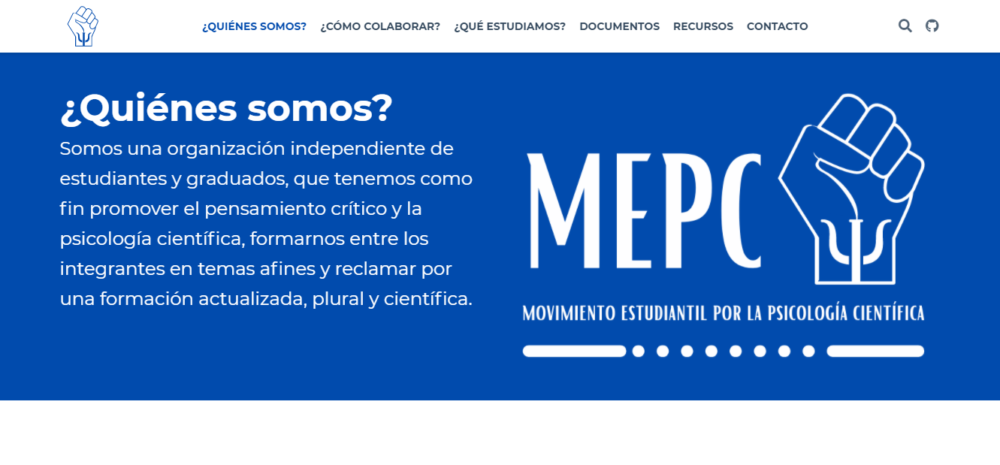

## Sitio web de MEPC en GitHub

[](http://mepc.netlify.app)

Este es el sitio web para el Movimiento Estudiantil por la Psicología Científica (MEPC), construido con Hugo y hosteado con Netlify. Podés editarlo directamente en un navegador a través de GitHub (no recomendado, ya que no vas a poder visualizar las modificaciones) o editarlo a través de un IDE, tal como RStudio, Jupyter o, en nuestro caso y el que recomendamos, Visual Studio Code.

Lo que tenés que hacer es lo siguiente:
1. Instalar [Visual Studio Code](https://code.visualstudio.com/download).
2. Instalar las extensiones [Github Pull Requests and Issues](https://marketplace.visualstudio.com/items?itemName=GitHub.vscode-pull-request-github) (para actualizar cambios de manera fácil) y, opcionalmente, [Browser Preview](https://marketplace.visualstudio.com/items?itemName=auchenberg.vscode-browser-preview) (para ver una ventana en miniatura de las modificaciones).
3. Clonar este repositorio yendo a "Source Control", luego "Clone repository" y copiando y pegando la URL. 
4. Instalar Hugo Extended y sus prerequisitos, siguiendo las [instrucciones acá](https://wowchemy.com/docs/install-locally/#prerequisites) (depende de tu sistema operativo).
5. Finalmente, tipeá el comando ```hugo server``` en la terminal.

Una vez que pudiste correr la página localmente, podrás contribuir de varias maneras a efectivizar cambios en la misma. Por ejemplo:

a) Escribiendo código.
b) Mejorando la documentación.
c) Reportando errores.

En los casos a) y b), lo que necesitás hacer es [crear un pull request](https://docs.github.com/en/github/collaborating-with-issues-and-pull-requests/creating-a-pull-request). En el caso c), lo que necesitás hacer es [dirigirte a issues](https://github.com/mepc-website/mepc/issues/) y reportar de la manera más detallada posible.

## Créditos
```
MetaDocencia (https://metadocencia.netlify.app/).
Forrt (https://forrt.org/).
```
